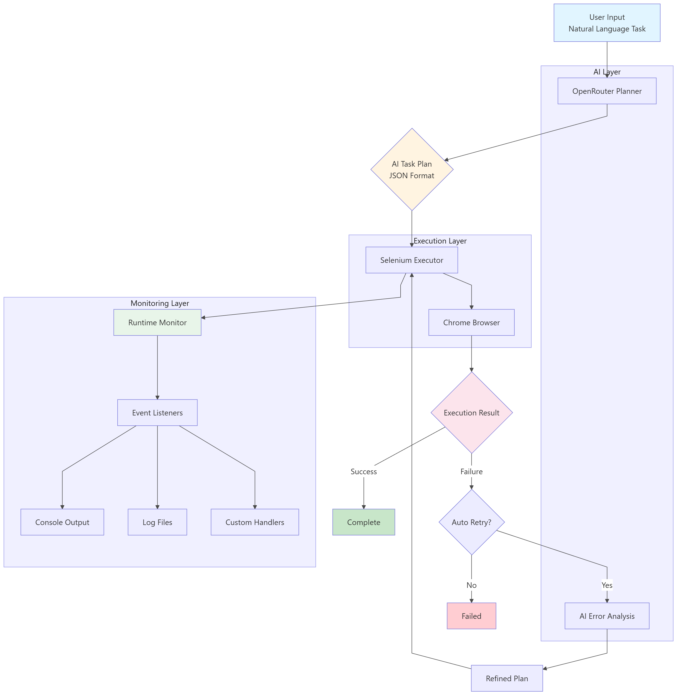

# AI-Controlled Selenium with Runtime Monitoring

Complete system for running Selenium automation controlled by AI (OpenRouter) with real-time runtime monitoring.

## run
 - install
 ```bash
uv sync
```

 - run
 ```bash
uv run main.py
```
---

### architecture.mermaid

## Features

✓ **AI Task Planning**: Natural language → Selenium commands
✓ **Runtime Monitoring**: Live step-by-step execution tracking
✓ **Event System**: Extensible listeners for custom monitoring
✓ **Self-Healing**: AI-powered retry with alternative selectors
✓ **Screenshot Capture**: Automatic screenshots on errors
✓ **Execution Logs**: JSON logs of complete execution
✓ **Safe Execution**: Whitelisted actions, timeout protection

## Architecture

```
User Prompt (Natural Language)
    ↓
OpenRouter (AI Planning)
    ↓
Task Plan (JSON)
    ↓
Selenium Executor ←→ Runtime Monitor
    ↓                      ↓
Browser               Event Listeners
```

## Installation

### 1. Install Python dependencies

```bash
pip install -r requirements.txt
```

### 2. Install Chrome WebDriver

```bash
# Option A: Using webdriver-manager (automatic)
pip install webdriver-manager

# Option B: Manual installation
# Download from https://chromedriver.chromium.org/
# Add to PATH
```

### 3. Get OpenRouter API Key

1. Sign up at https://openrouter.ai/
2. Create API key
3. Add to your code or environment variable

```bash
export OPENROUTER_API_KEY="your-key-here"
```

## Quick Start

### Basic Usage

```python
from orchestrator import AISeleniumOrchestrator

# Initialize
orchestrator = AISeleniumOrchestrator(
    openrouter_api_key="YOUR_KEY",
    headless=False,
    auto_retry=True
)

# Execute task in natural language
orchestrator.execute_task("""
    Go to google.com and search for "AI automation"
""")

# Cleanup
orchestrator.cleanup()
```

### With Custom Monitoring

```python
from orchestrator import AISeleniumOrchestrator

orchestrator = AISeleniumOrchestrator(
    openrouter_api_key="YOUR_KEY"
)

# Add custom event listener
def alert_on_failure(event):
    if event.status == "failed":
        print(f"ALERT: {event.error}")
        send_notification(event.screenshot_path)
        
orchestrator.monitor.add_listener(alert_on_failure)

# Execute
orchestrator.execute_task("Your task here...")
orchestrator.cleanup()
```

## Task Plan Format

AI generates JSON plans with these actions:

### Open URL
```json
{"action": "open", "url": "https://example.com"}
```

### Type Text
```json
{"action": "type", "selector": "#username", "value": "john@example.com"}
```

### Click Element
```json
{"action": "click", "selector": "button[type='submit']"}
```

### Wait
```json
{"action": "wait", "seconds": 3}
```

### Screenshot
```json
{"action": "screenshot"}
```

## Runtime Monitoring

### Event Structure

Each step emits events:

```python
{
    "step_index": 0,
    "action": "type",
    "status": "success",  # started, success, failed
    "timestamp": "2024-02-03T10:30:45.123456",
    "selector": "#username",
    "url": "https://example.com/login",
    "value": "user@example.com",
    "error": null,
    "screenshot_path": null
}
```

### Built-in Console Listener

Automatic colored console output:

```
[10:30:45] ⏳ Step 0: open
[10:30:46] ✓ Step 0: open
[10:30:46] ⏳ Step 1: type (#username)
[10:30:47] ✓ Step 1: type (#username)
[10:30:47] ⏳ Step 2: click (button[type='submit'])
[10:30:48] ✗ Step 2: click (button[type='submit'])
  Error: Element not found
```

### Custom Listeners

Add your own monitoring:

```python
def websocket_listener(event):
    """Send events to WebSocket clients"""
    ws_broadcast(event.to_json())
    
def database_logger(event):
    """Log to database"""
    db.insert('automation_logs', event.to_dict())
    
def slack_notifier(event):
    """Notify team on failures"""
    if event.status == "failed":
        slack.post(f"Automation failed: {event.error}")

orchestrator.monitor.add_listener(websocket_listener)
orchestrator.monitor.add_listener(database_logger)
orchestrator.monitor.add_listener(slack_notifier)
```

## Self-Healing

When a step fails, the system can:

1. Capture error details + DOM snapshot
2. Ask AI to suggest alternative selector/approach
3. Generate new plan
4. Retry execution

```python
orchestrator = AISeleniumOrchestrator(
    openrouter_api_key="YOUR_KEY",
    auto_retry=True,      # Enable self-healing
    max_retries=2         # Max retry attempts
)
```

## Execution Logs

### Save to File

```python
orchestrator.save_log("execution_log.json")
```

### Get Programmatically

```python
log = orchestrator.get_execution_log()
for event in log:
    print(f"{event['action']}: {event['status']}")
```

### Analyze Execution

```python
status = orchestrator.monitor.get_current_status()
print(f"Success rate: {status['completed']/status['total_steps']*100}%")
```

## Report Generation

### Automatic Report Generation

Reports are automatically generated after each execution in interactive and single-task modes.

### Generate Reports Programmatically

```python
# Generate HTML report (default)
html_report = orchestrator.generate_report(format='html')
print(f"Report saved: {html_report}")

# Generate JSON report
json_report = orchestrator.generate_report(format='json')

# Generate text report
text_report = orchestrator.generate_report(format='text')

# Custom output directory
report = orchestrator.generate_report(
    format='html',
    output_dir='./my_reports'
)
```

### Report Formats

#### HTML Report
- Visual, interactive report with charts and statistics
- Color-coded step execution
- Error details with screenshots
- URLs visited
- Perfect for sharing with team

#### JSON Report
- Structured data format
- Complete execution details
- Easy to parse programmatically
- Ideal for integration with other tools

#### Text Report
- Simple, readable format
- Great for logs and email
- Console-friendly
- Quick overview

### Generate Reports from Existing Logs

```bash
# Generate HTML report from log file
python generate_report.py execution_log.json

# Generate all formats
python generate_report.py execution_log.json --format all

# Custom output directory
python generate_report.py execution_log.json --output ./reports
```

### Get Execution Summary

```python
summary = orchestrator.get_summary()

print(f"Execution ID: {summary['execution_id']}")
print(f"Status: {summary['status']}")
print(f"Success Rate: {summary['success_rate']}%")
print(f"Duration: {summary['duration']}")
print(f"Total Steps: {summary['total_steps']}")
print(f"Failed Steps: {summary['failed_steps']}")
```

### Report Contents

Each report includes:
- **Summary Statistics**: Total steps, success rate, duration
- **Step-by-step Execution**: Detailed breakdown of each action
- **Error Details**: Error messages and screenshots for failed steps
- **URLs Visited**: List of all pages accessed
- **Timestamps**: Execution start and end times
- **Screenshots**: Links to error screenshots

## Advanced Configuration

### Headless Mode

```python
orchestrator = AISeleniumOrchestrator(
    openrouter_api_key="YOUR_KEY",
    headless=True  # No visible browser
)
```

### Custom Model

```python
orchestrator = AISeleniumOrchestrator(
    openrouter_api_key="YOUR_KEY",
    model="anthropic/claude-3.5-sonnet"  # Use Claude
)
```

### Screenshot Directory

```python
from selenium_executor import SeleniumExecutor

executor = SeleniumExecutor(
    monitor=monitor,
    screenshot_dir="/path/to/screenshots"
)
```

## Security Best Practices

### 1. Whitelist Actions
Only these actions are allowed:
- open
- type
- click
- wait
- screenshot

### 2. Validate Selectors
```python
# Add custom validation
def validate_selector(selector):
    if "eval(" in selector or "javascript:" in selector:
        raise ValueError("Invalid selector")
```

### 3. Timeout Protection
All Selenium actions have 10-second timeout:

```python
executor.timeout = 15  # Increase if needed
```

### 4. Never Execute Arbitrary Code
System NEVER uses `eval()` or `exec()` on AI output

## Production Deployment

### Environment Variables

```bash
export OPENROUTER_API_KEY="your-key"
export SELENIUM_HEADLESS="true"
export SCREENSHOT_DIR="/var/log/selenium/screenshots"
```

### Docker Example

```dockerfile
FROM python:3.11

# Install Chrome
RUN wget -q -O - https://dl-ssl.google.com/linux/linux_signing_key.pub | apt-key add -
RUN echo "deb http://dl.google.com/linux/chrome/deb/ stable main" >> /etc/apt/sources.list.d/google.list
RUN apt-get update && apt-get install -y google-chrome-stable

# Install ChromeDriver
RUN wget -O /tmp/chromedriver.zip http://chromedriver.storage.googleapis.com/$(curl -sS chromedriver.storage.googleapis.com/LATEST_RELEASE)/chromedriver_linux64.zip
RUN unzip /tmp/chromedriver.zip chromedriver -d /usr/local/bin/

# Install Python dependencies
COPY requirements.txt .
RUN pip install -r requirements.txt

# Copy application
COPY . /app
WORKDIR /app

CMD ["python", "main.py"]
```

## Error Handling

### Common Issues

**Chrome not found**
```bash
# Ubuntu/Debian
sudo apt-get install google-chrome-stable

# macOS
brew install --cask google-chrome
```

**ChromeDriver version mismatch**
```bash
pip install webdriver-manager
# Uses automatic version matching
```

**OpenRouter API errors**
- Check API key validity
- Verify account has credits
- Check rate limits

## Examples

See `example_usage.py` for complete examples:

1. **Basic Google Search with Reports**
2. **Form Filling with Text Report**
3. **Custom Monitoring with All Report Formats**
4. **Generate Reports from Existing Logs**

### Quick Example with Reporting

```python
from orchestrator import AISeleniumOrchestrator

orchestrator = AISeleniumOrchestrator(
    openrouter_api_key="YOUR_KEY"
)

# Execute task
orchestrator.execute_task("Go to google.com")

# Generate reports
html_report = orchestrator.generate_report(format='html')
json_report = orchestrator.generate_report(format='json')

# Get summary
summary = orchestrator.get_summary()
print(f"Success: {summary['success_rate']}%")

orchestrator.cleanup()
```

## API Reference

### AISeleniumOrchestrator

Main controller class.

**Parameters:**
- `openrouter_api_key` (str): OpenRouter API key
- `model` (str): AI model to use
- `headless` (bool): Run browser in headless mode
- `auto_retry` (bool): Enable AI-powered retry
- `max_retries` (int): Maximum retry attempts

**Methods:**
- `execute_task(prompt: str) -> bool`: Execute automation task
- `get_execution_log() -> list`: Get execution log
- `save_log(filepath: str)`: Save log to file
- `cleanup()`: Close browser and cleanup

### RuntimeMonitor

Event monitoring system.

**Methods:**
- `add_listener(callback)`: Add event listener
- `emit(event)`: Emit event to listeners
- `get_current_status()`: Get execution status
- `get_log()`: Get complete event log

### OpenRouterPlanner

AI task planner.

**Methods:**
- `get_task_plan(prompt: str) -> dict`: Generate task plan
- `refine_plan_with_error(plan, step, error, dom)`: Fix failed plan

## Contributing

Contributions welcome! Areas for improvement:

- Vision model integration for DOM reasoning
- Playwright support
- WebSocket dashboard
- Task memory / learning
- Multi-agent coordination

## License

MIT License

## Support

For issues, questions, or feature requests, please open an issue on GitHub.
